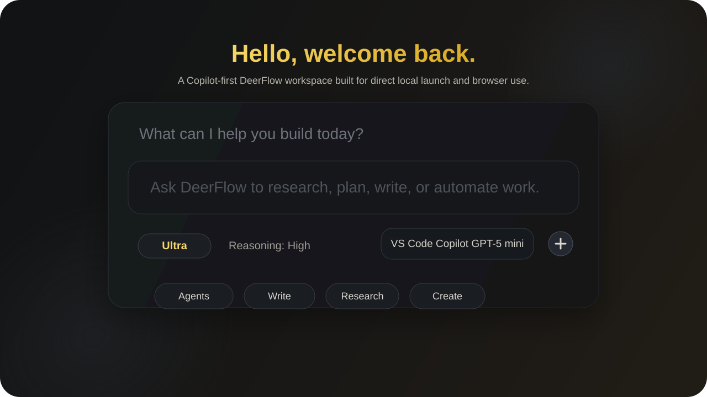
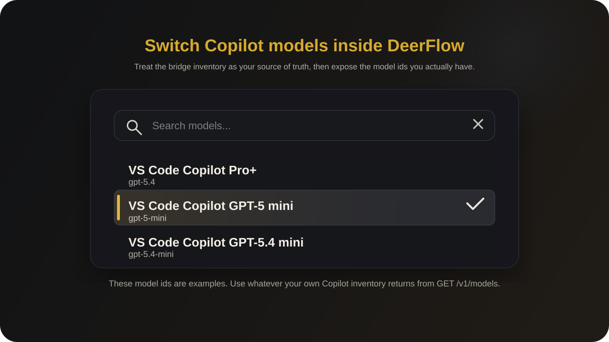

# DeerFlow to Copilot

[English](./README.md) | 简体中文

[](./scripts/start-deerflow-ui.ps1)
[](./integrations/vscode-copilot-bridge/README.md)
[](./backend/pyproject.toml)
[](./frontend/package.json)
[](./LICENSE)



DeerFlow to Copilot 是一个基于 DeerFlow 2.0 的二次开发版本，定位非常明确：让已经在 VS Code 里使用 GitHub Copilot 的用户，不必先去接入新的模型厂商、不必先折腾一轮复杂配置，就能把 DeerFlow 本地跑起来，并直接在浏览器里开始使用。

它保留了 DeerFlow 2.0 原本的 agent、memory、LangGraph、sandbox 和浏览器工作台能力，但把产品体验重新整理成了一条更短、更直接的路径。

- 直接复用 VS Code 里已经可用的 Copilot 模型。
- 在 Windows 上通过一键脚本或 VS Code 构建任务启动。
- 减少首次使用时的 setup 摩擦，包括首个管理员初始化。
- 在 UI 中直接切换 Copilot Pro+、GPT-5 mini、GPT-5.4 mini。
- 把浏览器聊天、Copilot 联动、本地脚本和模型切换收拢到一条流里。

> 基于 DeerFlow 2.0
>
> 本项目是构建在 DeerFlow 2.0 之上的独立二次开发版本。上游项目依然是原始基础，必须保留其署名与许可信息。本仓库的目标不是替代上游，而是把默认体验收束到更适合 Copilot 用户的场景：更容易启动、更适合 Windows、更适合本地直连使用。上游仓库见 [bytedance/deer-flow](https://github.com/bytedance/deer-flow)。

## 这个二开版本解决了什么问题

原版 DeerFlow 2.0 很强，但第一次上手时，用户往往还要先做很多产品外的决定：用哪家模型、如何把编辑器和浏览器串起来、Windows 上怎么舒服地启动、首个管理员怎么初始化、本地凭据怎么保存与复用。

这个版本的目标就是把这些前置阻力砍掉。

如果你已经在 VS Code 里使用 GitHub Copilot，那么 DeerFlow to Copilot 会通过一个本地桥接扩展，让 DeerFlow 直接调用你当前 VS Code 会话里可用的 Copilot 模型。这样你更快就能走到真正有价值的那一步：打开浏览器、选模型、选模式、开始用。

## 和原始 DeerFlow 2.0 的具体差别

| 维度 | 原始 DeerFlow 2.0 | DeerFlow to Copilot |
| --- | --- | --- |
| 默认首次上手路径 | 通用多模型供应商接入 | Copilot-first 上手路径 |
| VS Code 集成 | 没有内建 Copilot bridge | 增加本地 VS Code Copilot bridge |
| Windows 启动体验 | 更偏 Git Bash 的本地流程 | PowerShell 一键启动，Docker 和本地自动回退 |
| 首个管理员初始化 | 更偏浏览器手动初始化 | 启动器可辅助完成首个本地管理员初始化 |
| 本地凭据复用 | 主要依赖环境变量 | 增加本地辅助脚本与配置复用 |
| 模型切换 | 取决于用户自己配置 provider | 预留 Copilot 多模型切换入口 |
| 文档重点 | 功能面广、适配通用场景 | 更强调 Copilot 用户一步步可用 |

## 这个项目最有价值的地方

### 1. 让 Copilot 用户少走弯路

在 [integrations/vscode-copilot-bridge/README.md](./integrations/vscode-copilot-bridge/README.md) 中，项目提供了一个本地 bridge。DeerFlow 通过它调用 VS Code 当前会话里的 Copilot 模型。Bridge 默认只监听本机回环地址，不导出 Copilot token，Copilot 授权仍由 VS Code 自己处理。

### 2. Windows 上终于像“产品”而不是“脚本集合”

[scripts/start-deerflow-ui.ps1](./scripts/start-deerflow-ui.ps1) 会优先走 Docker，Docker 不可用时回退到本地开发链路；还能顺带处理 Copilot bridge、自检、管理员初始化和浏览器打开。这对真正日常使用很关键。

### 3. 最终目标是浏览器可用，而不是命令行看日志

这个仓库的核心目标不是让你看到一堆服务启动输出，而是让你尽快在浏览器里完成登录、切换模型、切换模式，然后开始提问和执行任务。整个脚本和文档体系都是围绕这个目标做的。

### 4. Copilot 模型可以直接切换



下面这三种只是示例，不是硬编码死的限制。你最终能暴露哪些模型，取决于你自己的 GitHub Copilot 等级，以及本地 bridge 在 `GET /v1/models` 里实际返回了哪些模型 id。

这份仓库当前主要以内置示例的方式展示这三种 Copilot 模型：

- VS Code Copilot Pro+，对应 `gpt-5.4`
- VS Code Copilot GPT-5 mini，对应 `gpt-5-mini`
- VS Code Copilot GPT-5.4 mini，对应 `gpt-5.4-mini`

### 5. 底层依然是 DeerFlow 2.0，不是简化玩具版

你得到的不是一个缩水版壳子，而是基于 DeerFlow 2.0 的完整底座：LangGraph 调度、memory、tools、sandbox、skills、多步骤执行，以及浏览器工作台。

## 一步步启动并最终在浏览器中使用

下面这条路径是我建议对外公开时默认展示的使用路径，重点就是简单、直接、少踩坑。

### 第 1 步：准备依赖

先准备这些依赖：

- 安装并登录 VS Code，确保 GitHub Copilot 可用
- Node.js 22+
- pnpm
- Python 3.12+
- uv
- nginx
- 如果希望最省事，建议装好 Docker Desktop

### 第 2 步：克隆仓库

```bash
git clone https://github.com/steven140811/DeerFlow-to-Copilot.git
cd DeerFlow-to-Copilot
```

### 第 3 步：生成本地配置文件

```bash
make config
```

这一步会创建本地 `config.yaml`。它默认被 Git 忽略，不应该提交到公开仓库。

### 第 4 步：在 `config.yaml` 中加入 Copilot 模型配置

你可以直接从 [config.example.yaml](./config.example.yaml) 复制相关示例，也可以先使用下面这段最小可用配置：

这三条模型配置只是常见示例，不是必须只能这样写。如果你自己的 Copilot 等级通过本地 bridge 暴露出了别的模型 id，就用你实际拿到的模型 id 来配置。

```yaml
models:
  - name: vscode-copilot
    display_name: VS Code Copilot Pro+
    use: deerflow.models.vscode_copilot_provider:VSCodeCopilotChatModel
    model: gpt-5.4
    base_url: http://127.0.0.1:8765
    request_timeout: 600.0
    max_retries: 2
    supports_reasoning_effort: true
    reasoning_effort: xhigh
    supports_vision: false

  - name: vscode-copilot-gpt-5-mini
    display_name: VS Code Copilot GPT-5 mini
    use: deerflow.models.vscode_copilot_provider:VSCodeCopilotChatModel
    model: gpt-5-mini
    base_url: http://127.0.0.1:8765
    request_timeout: 600.0
    max_retries: 2
    supports_reasoning_effort: true
    reasoning_effort: xhigh
    supports_vision: false

  - name: vscode-copilot-gpt-5.4-mini
    display_name: VS Code Copilot GPT-5.4 mini
    use: deerflow.models.vscode_copilot_provider:VSCodeCopilotChatModel
    model: gpt-5.4-mini
    base_url: http://127.0.0.1:8765
    request_timeout: 600.0
    max_retries: 2
    supports_reasoning_effort: true
    reasoning_effort: xhigh
    supports_vision: false
```

### 第 5 步：把 Copilot bridge 安装到主 VS Code 配置中

```powershell
pwsh -ExecutionPolicy Bypass -File .\scripts\install-vscode-copilot-bridge.ps1
```

脚本执行完成后，重载一次当前 VS Code 窗口。这样主窗口就能直接加载 bridge 扩展，后续不需要每天都开一个单独的 Extension Development Host。

### 第 6 步：可选地保存 DeerFlow 本地登录配置

```powershell
pwsh -ExecutionPolicy Bypass -File .\scripts\configure-vscode-to-deerflow.ps1
```

这一步是为了本地使用方便，不是为了共享，也不是为了跨机器同步凭据。

### 第 7 步：启动 DeerFlow

在 Windows 上，我推荐两条路径。

方案 A：用 VS Code 构建任务启动。

- 按 `Ctrl + Shift + B`
- 选择 `DeerFlow: One-click Launch UI`

方案 B：直接运行启动器。

```powershell
pwsh -ExecutionPolicy Bypass -File .\scripts\start-deerflow-ui.ps1 -Email you@example.com
```

这里的 `-Email` 和 `-Password` 不是去外部网站注册的真实账号，而是你为当前这套本地 DeerFlow 自己创建的登录凭证。你可以自己填写任意可记住的邮箱和密码，后面本地登录 DeerFlow 就靠这一组凭证。

如果你没有显式传 `-Password`，脚本可以安全提示输入。启动器默认会尝试完成这些事情：

- Docker 可用时优先走 Docker
- Docker 不可用时回退到本地开发模式
- 默认启动或检查 Copilot bridge
- 需要时初始化首个管理员账户
- 自动打开浏览器 UI

### 第 8 步：在浏览器里真正开始使用

服务起来之后，打开或继续使用 `http://localhost:2026`。

接下来按这个顺序操作：

1. 完成 setup 或直接用你刚才本地创建的那组 email 和 password 登录。
2. 进入主工作台页面。
3. 在模型选择器里选择一个 Copilot 模型。
4. 选择适合当前任务的模式。
5. 直接开始聊天或发起任务。

目前的主要模式可以这样理解：

- `flash`：最快，适合轻量问题
- `standard`：平衡型交互
- `pro`：更深的规划与更高推理力度
- `ultra`：规划加 subagents，适合更重任务

### 第 9 步：需要时执行 bridge 自检

快速验证：

```powershell
pwsh -ExecutionPolicy Bypass -File .\scripts\check-deerflow-copilot-bridge.ps1 -SkipRoundTrip
```

完整端到端验证：

```powershell
pwsh -ExecutionPolicy Bypass -File .\scripts\check-deerflow-copilot-bridge.ps1
```

## 一句话总结这条上手路径

如果你只想记住最短路径，那就是：

1. 克隆仓库。
2. 生成 `config.yaml`。
3. 把 Copilot 模型配置复制进去。
4. 安装 bridge。
5. 重载 VS Code 一次。
6. 用一键启动脚本或 `Ctrl + Shift + B` 启动。
7. 打开 `http://localhost:2026`。
8. 登录。
9. 选模型。
10. 开始用。

## 更详细的差异分析文档

如果你想系统看清楚这份仓库相对 DeerFlow 2.0 到底改了哪些方向、分别落在哪些文件上，可以继续看 [docs/DEERFLOW_TO_COPILOT_DIFF.md](./docs/DEERFLOW_TO_COPILOT_DIFF.md)。

其中会覆盖：

- Copilot bridge 与后端 provider 层
- 一键启动、bridge 安装、Windows 自动化脚本
- 前端模式和模型处理逻辑的调整
- 本地代理与服务路由变化
- 配置模板与技能包改动

## 合规、安全与公开发布边界

既然这个仓库的目标是公开发布，那这些边界必须写清楚：

- 不要提交 `config.yaml`、`.env`、本地凭据文件或任何 API key。
- Bridge 默认应该只绑定在 `127.0.0.1`。
- GitHub Copilot 的认证仍然留在 VS Code 内部完成。
- 本地辅助脚本保存的数据只适用于当前机器与当前用户。
- 必须保留 DeerFlow 2.0 的上游署名与 MIT 许可信息。

这个项目是面向社区的二次开发版本，不应表述为 GitHub、Microsoft 或 ByteDance 的官方产品。

## 公开发布前检查清单

在把仓库推到公开 GitHub 仓库之前，至少确认下面几点：

- `config.yaml` 仍然处于忽略状态且没有被暂存
- `.env` 没有被暂存
- 跟踪文件里没有密码、token 或 API key
- 图片里没有包含敏感信息
- README 引导用户使用模板文件，而不是你的本地私有文件

## 继续阅读

- [Install.md](./Install.md)
- [config.example.yaml](./config.example.yaml)
- [integrations/vscode-copilot-bridge/README.md](./integrations/vscode-copilot-bridge/README.md)
- [skills/public/vscode-to-deerflow/SKILL.md](./skills/public/vscode-to-deerflow/SKILL.md)
- [SECURITY.md](./SECURITY.md)
- [Original DeerFlow 2.0](https://github.com/bytedance/deer-flow)

## 对上游项目的说明

DeerFlow 2.0 仍然是这项工作的核心基础。如果你想看更完整的上游文档、更广泛的 provider 矩阵或原始路线图，请直接阅读上游仓库。本二开版本的存在价值，不是代替 DeerFlow，而是让 Copilot 用户更快进入一个真正可用的 DeerFlow 浏览器工作流。
